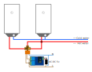

# Hot water selector
The purpose of this project is to build a hot water selector for a house using a three-way valve, a dual relay module and an ESP01 module.

### Use case
A house has 2 hot water accumulators used on different situations:
 * Electric water heater. The source of power is surplus energy of a solar PV system.
 * Gas water heater. Only used when there is no enough solar power to heat water.

This system allows an automatic hot water source selection based on the temperatures of water in both tanks.

This repository does not cover the automation system as this depends on the particular implementation. This ESP01 module only exposes a MQTT interface for changing the source of water.

### Components
 * Three-way valve. 2 input, 1 output [Example](https://aliexpress.com/item/1005002019014945.html)
 * LCTech dual relay module based on STM chip [Example](https://aliexpress.com/item/32963636755.html)
 * ESP01/ESP01S module. Often included with the relay module. [Example](https://aliexpress.com/item/32969275894.html)
 * AC-DC 5v power supply [Example](https://aliexpress.com/item/32360232521.html)

### Schematic

<a href="./docs/schema.svg"></a>

### Customizations
These are the default values that can be changed using the `substitutions` block on the yaml.
 * `devicename`: by default, the device is called `hotwaterselector`. This is also the base MQTT path.
 * `opentime`: Time needed to open/close the valve. By default, the time is set to 12 seconds.
   * Careful: if time is set too low the valve won't fully open.

### MQTT
 * Monitor position [0-100]: `hotwaterselector/cover/valve3w/position/state`
 * Set position: Send `1` or `0` to `hotwaterselector/cmd/goto`

## Build with ESPHome

I use the docker image method because it does not need any setup steps. If you want to use other build method, please refer to [ESPHome build guides](https://esphome.io/guides/contributing.html#build)

Create the `secrets.yaml` file with the required configuration variables for your configuration.
```yaml
wifi_ssid: MY_WIFI_NAME
wifi_pass: my_wifi_password

mqtt_ip: 192.168.0.11
mqtt_port: 1883
mqtt_user: mqtt_user
mqtt_pass: mqtt_user_pass

ota_pass: some_random_password_or_string
api_pass: some_random_password_or_string
```

Build and run

```bash
$ docker run --rm -v "${PWD}:/config" --device /dev/ttyUSB0 -it esphome/esphome:latest run hotwatervalve_esp01.yaml
```

## Licensing

Arturo Casal

Shield: [![CC BY 4.0][cc-by-shield]][cc-by]

This work is licensed under a
[Creative Commons Attribution 4.0 International License][cc-by].

[![CC BY 4.0][cc-by-image]][cc-by]

[cc-by]: http://creativecommons.org/licenses/by/4.0/
[cc-by-image]: https://i.creativecommons.org/l/by/4.0/88x31.png
[cc-by-shield]: https://img.shields.io/badge/License-CC%20BY%204.0-lightgrey.svg

#### This software uses ESPHome

Copyright (c) 2019 ESPHome